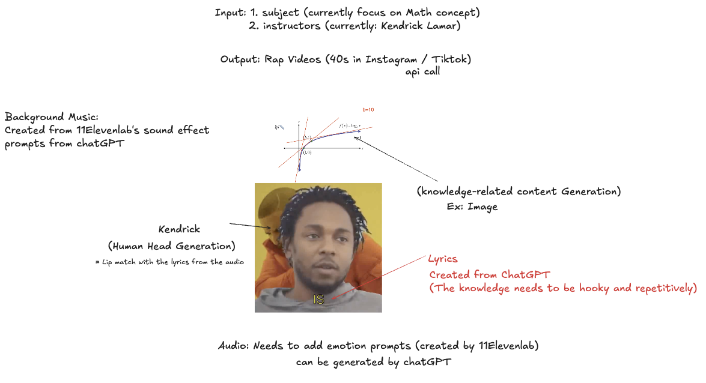

# Bar Keepers
- AI-Powered Educational Raps: An Automated Video Generation Pipeline


Final - [Instagram Post] (https://www.instagram.com/know.unity.testbot/)
---
This project is an automated pipeline that transforms any educational topic into a short, engaging music video featuring a talking head avatar, dynamic subtitles, and AI-generated music. The final output is designed for short-form video platforms like TikTok and Instagram to make learning fun and memorable.

The entire pipeline is built to run on **[Modal](https://modal.com/)**, leveraging the power of a single **NVIDIA H100 GPU** to accelerate the most demanding AI tasks, from 3D head generation to audio transcription[1][3][5][7].

## The Concept

The core idea is to fuse education with entertainment. Instead of dry text, users learn through a catchy rap song, with the key information reinforced through a visually engaging video format.



## The Automated Workflow

The project consists of several automated stages that work together to produce the final video:


1.  **Lyric Generation:** An LLM creates educational rap lyrics about a user-provided topic.
2.  **Voice Synthesis:** The lyrics are converted into a high-quality, rap-style voice using **ElevenLabs**.
3.  **Music Generation:** A background beat is generated to match the rhythm and style of the vocals.
4.  **Talking Head Synthesis:** The core of the project. Using the **Real3D-Portrait** model, a realistic 3D talking head is generated, with lip movements perfectly synced to the rap audio[4].
5.  **Word-by-Word Subtitles:** The audio is transcribed using **`whisper-timestamped`** to get precise timings for every word. These are then rendered onto the video as a "karaoke-style" animation.

## Tech Stack & Key Components

This project integrates several cutting-edge AI models and tools:

*   **3D Talking Head Generation:** Based on the ICLR 2024 Spotlight paper **[Real3D-Portrait: One-shot Realistic 3D Talking Portrait Synthesis](https://arxiv.org/abs/2312.00557)**.
*   **Cloud Compute & Infrastructure:** All heavy computation is offloaded to **[Modal](https://modal.com/)**, running containerized environments on demand. The most intensive tasks leverage the speed of an **NVIDIA H100 80GB GPU** for fast processing[1][3][5][7].
*   **Audio Transcription:** **`whisper-timestamped`** is used to obtain precise word-level start and end times for dynamic subtitle animation.
*   **Video & Audio Processing:** **FFmpeg** and **MoviePy** are used for pre-processing input data and rendering the final subtitled video.
*   **Containerization:** The entire complex software environment, including specific versions of PyTorch, CUDA, and system libraries, is defined in a **Dockerfile** to ensure reproducibility[1].

## Project Structure

The repository is organized into a clean and scalable structure:

```
Knowunity_project/
├── .gitignore
├── Dockerfile
├── README.md
├── data/
│ ├── raw/
│ └── processed/
├── docs/
├── notebooks/
├── output/
└── src/
├── helpers/
├── add_subtitles_modal.py
├── preprocess_data.py
└── run_modal.py
```


## How to Run

This project is designed to be run from your local machine, with all heavy lifting executed remotely on Modal.

### 1. Setup

First, ensure you have Modal installed and configured:

Install the Modal client
pip install modal

Set up your Modal token (this will open a browser window)
modal token new

Clone this repository
git clone https://github.com/Poyen-Chen/Knowunity_project.git
cd Knowunity_project

Make sure you have a Hugging Face secret named 'huggingface-secret' in your Modal account.
You can create one on the Modal website with your Hugging Face token.
text

### 2. Usage Workflow

The process is broken down into three simple command-line steps. Run these commands from the **root directory** of the project (`Knowunity_project/`).

**Step 1: Pre-process Your Data**

Prepare your driving audio and video files. This script converts them to the formats required by the AI models. Place your raw files in the `data/raw/` folder first.

Example:
python src/preprocess_data.py
--input-dir data/raw
--output-dir data/processed
--audio-file your_audio.mp3
--video-file your_video.mp4

text
The processed files will be saved in `data/processed/`.

**Step 2: Generate the Main Video**

This command runs the core pipeline on Modal, using an H100 GPU to generate the talking head video. It uses your processed data as input[1].

Example:
python src/run_modal.py
--src-img data/raw/your_source_image.png
--drv-aud data/processed/your_audio_16khz.wav
--drv-pose data/processed/your_video_512x512.mp4
--bg-img data/raw/your_background.png
--out-name my_video.mp4

text
This will save the result to the `output/` folder.

**Step 3: Add Dynamic Subtitles**

This command takes the generated video, transcribes it, and burns in the word-by-word animated subtitles[1].

Example:
python src/add_subtitles_modal.py
--input-video output/my_video.mp4
--output-video output/my_video_with_subs.mp4
--gpu T4
--model medium

text
The final, shareable video will be saved in the `output/` folder.

## Acknowledgements

-   This project's 3D talking head generation is powered by the incredible work from the authors of **Real3D-Portrait**.
-   Cloud infrastructure and GPU acceleration are provided by **Modal Labs**.
